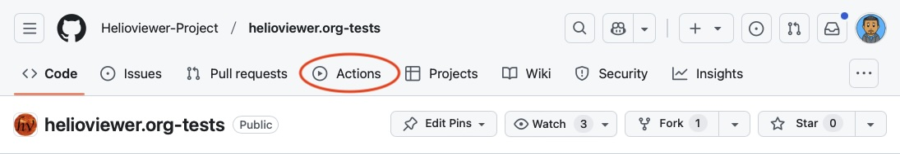
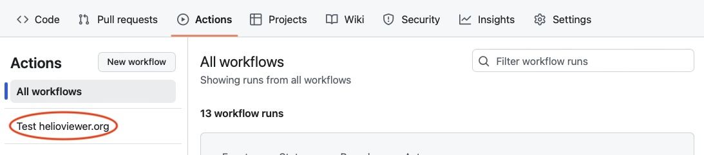
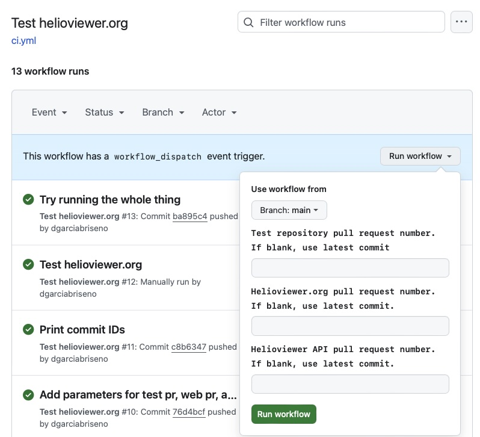

# Playwright Tests for Helioviewer.org

This repository contains playwright tests for [helioviewer.org](https://github.com/helioviewer-Project/helioviewer.org).

The main branch of tests run automatically when a pull request is made to
helioviewer.org, or the Helioviewer API repository. This is done through a
workflow trigger when a pull request is made in one of those repositories.

At this time, tests must be triggered manually.
Github doesn't allow triggering a workflow in a separate repository from a pull request.
We would need to implement a custom solution to make this work.

### Choosing Branches

Sometimes a change requires updating other repositories.
An update to helioviewer.org may depend on an update to the API.
You can manually dispatch tests to run on selected branches using github's
workflow dispatch feature. Follow these steps:

1. Go to actions


2. Select the test workflow


3. Enter the pull request numbers to test against. If left blank, then main
will be used by default.


## Composite Actions

This repository provides reusable composite actions for running Helioviewer tests in other workflows:

### playwright-test

Located at `.github/actions/playwright-test/action.yml`

Sets up the complete Helioviewer testing environment and runs Playwright tests for a specific shard.

**Inputs:**
- `helioviewer-org-ref` (optional): Git ref for helioviewer.org (default: 'main')
- `api-ref` (optional): Git ref for API repository (default: 'main')
- `helioviewer-tests-ref` (optional): Git ref for test repository (default: 'main')
- `shard-index` (required): Current shard index for test parallelization
- `shard-total` (required): Total number of shards

**What it does:**
1. Checks out test code to `helioviewer.org-tests/` directory
2. Uses the `helioviewer-docker` composite action to set up the environment
3. Installs Node.js and Playwright with dependencies
4. Runs Playwright tests for the specified shard
5. Uploads blob report artifacts

**Example usage:**
```yaml
- name: Run Playwright tests
  uses: Helioviewer-Project/helioviewer.org-tests/.github/actions/playwright-test@main
  with:
    helioviewer-org-ref: 'refs/pull/123/head'
    api-ref: 'main'
    helioviewer-tests-ref: 'main'
    shard-index: 1
    shard-total: 5
```

### playwright-merge-reports

Located at `.github/actions/playwright-merge-reports/action.yml`

Merges Playwright blob reports from multiple shards into a single HTML report.

**Inputs:**
- `test-repo-path` (required): Path to the checked out helioviewer.org-tests repository

**What it does:**
1. Installs Node.js and dependencies
2. Downloads all blob report artifacts
3. Merges them into a single HTML report
4. Uploads the HTML report as an artifact

**Example usage:**
```yaml
- name: Checkout test code
  uses: actions/checkout@v4
  with:
    repository: 'Helioviewer-Project/helioviewer.org-tests'
    path: test-repo

- name: Merge reports
  uses: Helioviewer-Project/helioviewer.org-tests/.github/actions/playwright-merge-reports@main
  with:
    test-repo-path: test-repo
```

### Running Tests Complete Example

Here's a complete workflow example showing how to run tests in parallel shards and merge the reports:

```yaml
name: Run Helioviewer Tests

on:
  pull_request:
    branches: ["main"]

jobs:
  playwright-tests:
    strategy:
      matrix:
        shardIndex: [1, 2, 3, 4, 5]
        shardTotal: [5]
      fail-fast: false

    timeout-minutes: 99
    runs-on: ubuntu-latest

    steps:
      - name: Run Playwright tests
        uses: Helioviewer-Project/helioviewer.org-tests/.github/actions/playwright-test@main
        with:
          helioviewer-org-ref: 'main'
          api-ref: 'main'
          helioviewer-tests-ref: 'main'
          shard-index: ${{ matrix.shardIndex }}
          shard-total: ${{ matrix.shardTotal }}

  merge-reports:
    if: ${{ !cancelled() }}
    needs: [playwright-tests]
    runs-on: ubuntu-latest

    steps:
      - name: Checkout test code
        uses: actions/checkout@v4
        with:
          repository: 'Helioviewer-Project/helioviewer.org-tests'
          path: helioviewer.org-tests

      - name: Merge reports
        uses: Helioviewer-Project/helioviewer.org-tests/.github/actions/playwright-merge-reports@main
        with:
          test-repo-path: helioviewer.org-tests
```
